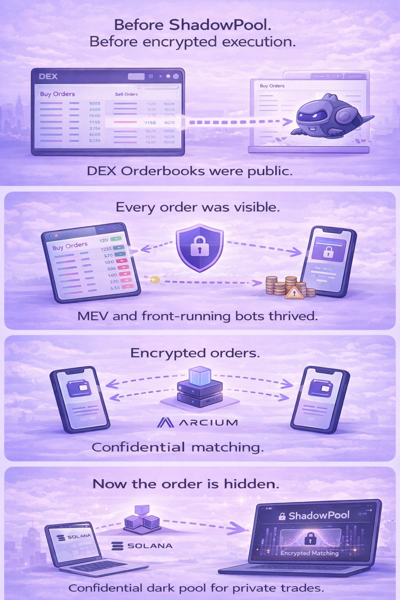
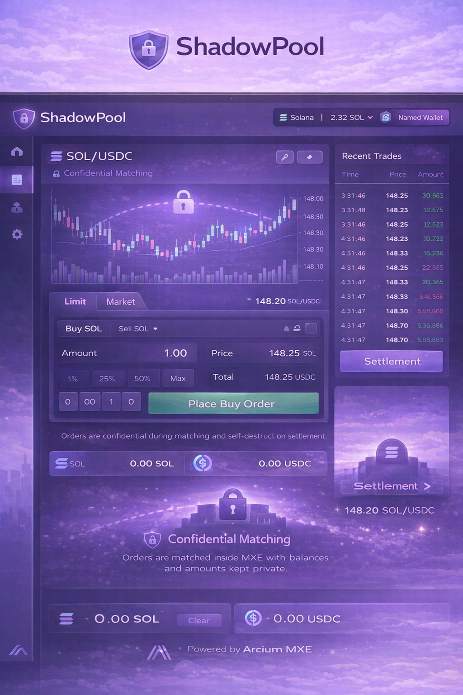

# ShadowPool (Solana + Arcium)

> ShadowPool explores how encrypted execution can enable private trading on public blockchains.

ShadowPool is a confidential trading venue prototype built on Solana using Arcium encrypted compute.

Traditional on-chain trading exposes:

- order intent
- balances
- position sizes

This creates opportunities for:

- front-running
- MEV extraction
- strategy leakage

ShadowPool explores a different model.

Orders remain encrypted during execution.  
Matching and risk checks run inside Arcium MXE.  
Only final settlement outcomes are revealed on-chain.

---

## Problem

Most decentralized exchanges rely on transparent execution.

When orders are visible before execution:

- traders react to each other's intent
- front-running becomes possible
- sophisticated actors extract MEV

Transparency protects settlement but exposes strategy.

---

## Solution

ShadowPool separates execution confidentiality from settlement transparency.

Encrypted:

- order intent
- balances
- trade size

Revealed:

- final trade execution
- settlement results

This allows trading without exposing intermediate signals.

---

## Arcium Integration

Arcium MXE performs:

- encrypted order matching
- confidential balance verification
- risk checks
- trade execution logic

Solana handles:

- settlement
- asset custody
- final trade recording

Arcium becomes the confidential execution layer.

---

## Execution Flow

User order  
↓  
Encrypted submission  
↓  
Arcium MXE matching  
↓  
Risk check + execution  
↓  
Settlement on Solana

---

## Architecture

---

## UI Mock

---

## Disclaimer

This project is a structural prototype exploring encrypted execution in trading venues.

It is not production-ready.

---

## Wallet

`4Y8R73V9QpmL2oUtS4LrwdZk3LrPRCLp7KGg2npPkB1u`
